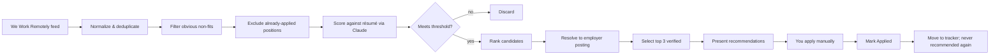
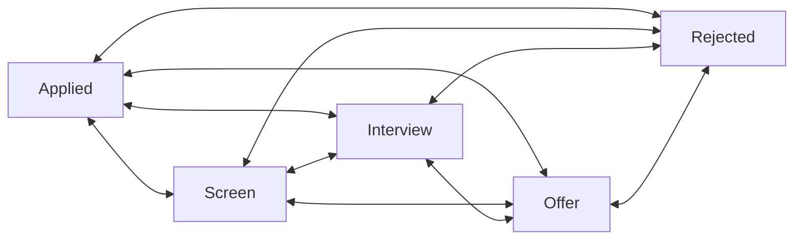
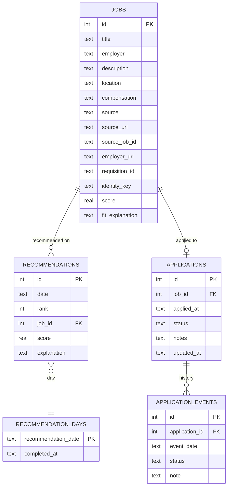
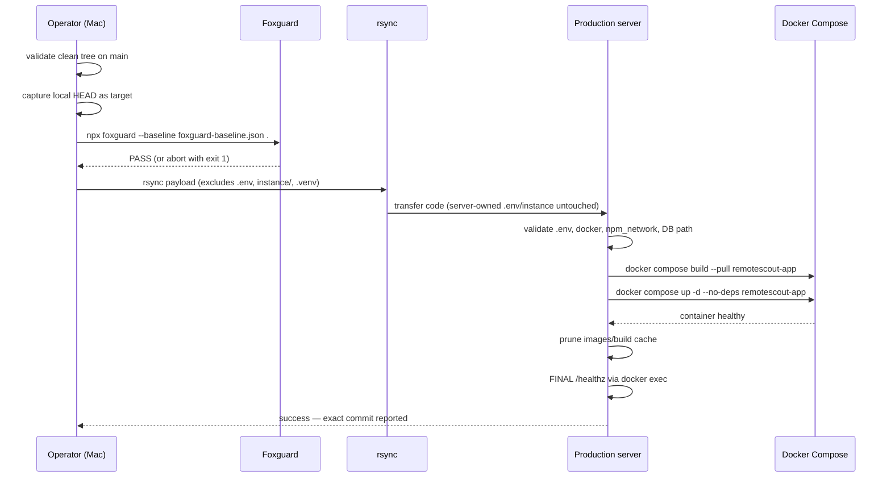

# Remote Scout

Remote Scout is a personal job-recommendation and application-tracking tool for high-quality remote positions. It searches broadly but presents narrowly: every day it evaluates remote job listings, filters and scores them against your résumé, and surfaces **at most three strong recommendations** — each with a verified employer-owned application link.

<p align="center">
  
  
  
  
  
  
  
  
</p>

## Contents

- [Why Remote Scout?](#why-remote-scout)
- [Features](#features)
- [How it works](#how-it-works)
- [Getting started](#getting-started)
- [Configuration](#configuration)
- [Daily recommendations via cron](#daily-recommendations-via-cron)
- [Application tracker](#application-tracker)
- [Database](#database)
- [Testing](#testing)
- [Project layout](#project-layout)
- [Deployment](#deployment)
- [Non-goals](#non-goals)

---

## Why Remote Scout?

Aggregate job sites surface enormous lists of positions, and most of the review burden lands on you. Remote Scout removes the noise:

1. It discovers remote positions from aggregate sources (used for **discovery only**).
2. It filters out clearly irrelevant positions before any scoring effort is spent.
3. It scores the survivors against your résumé using an LLM scorer.
4. It resolves each leading candidate back to the employer's own careers site or ATS so you apply on the **real employer posting**, never through an aggregate aggregator.
5. It presents **up to three** recommendations per day — deliberately small.

Once you apply, the position moves into a simple application tracker and is **never recommended again**.

## Features

- **Three recommendations per day, not a job feed** — quality over quantity; zero matches is a valid outcome.
- **Employer-site resolution** — leading candidates are matched to the hiring company's own posting/ATS before recommendation.
- **Duplicate protection** — the same opportunity found via multiple sources is deduplicated, and applied positions stay suppressed across sources.
- **Application tracker** — move applications through `Applied → Screen → Interview → Offer → Rejected` (any transition allowed; the tracker reflects reality, it is not a state machine).
- **Dated history** — every status change is appended as an immutable event with its date, shown oldest-first on the tracker.
- **Scheduled daily command** — `python -m remotescout.daily` builds today's recommendations headlessly for cron/systemd timers.
- **Lazy fallback** — if the scheduled run didn't happen, the first browser visit builds the day's recommendations on demand.

## How it works



The intermediate pipeline — every discovered job, every score, every rejection — is internal. The interface exposes only the day's recommendations and your application tracker.

## Getting started

Requires **Python 3.13** and an [Anthropic API key](https://console.anthropic.com/).

```bash
# clone and install
git clone <repository-url> remotescout
cd remotescout
python3.13 -m venv .venv
source .venv/bin/activate
pip install -r requirements.txt

# configure
cp .env.example .env   # or create .env with your key

# run tests
python -m pytest

# start the app
flask --app remotescout.app run --debug
```

Open <http://127.0.0.1:5000>, view the day's recommendations, apply on the employer's site, and mark positions Applied.

> **Note:** the first visit to `/` triggers recommendation generation, which makes live discovery, scoring, and resolution calls. Subsequent visits the same day read the persisted results.

## Configuration

All configuration lives in a `.env` file (or the environment) and is shared by the web app and the daily command.

| Variable | Default | Purpose |
|---|---|---|
| `ANTHROPIC_API_KEY` | *(required)* | API key for the Claude scorer |
| `ANTHROPIC_MODEL` | `claude-sonnet-5` | Claude model used for scoring |
| `REMOTESCOUT_DATABASE_PATH` | `instance/remotescout.db` | SQLite database location |
| `REMOTESCOUT_RESUME_PATH` | `docs/Michael-Buckingham-Resume-Infrastructure-Delivery-Director.pdf` | Résumé used for scoring |
| `REMOTESCOUT_RECOMMENDATION_THRESHOLD` | `70` | Minimum score for a recommendation |

## Daily recommendations via cron

The host operating system owns scheduling. Remote Scout exposes one command:

```bash
python -m remotescout.daily
```

```text
Remote Scout daily recommendations complete: 3 recommendations for 2026-08-12
```

- **Zero matches is success** — `0 recommendations` still exits 0.
- **Already-completed days are idempotent** — no rediscovery, no rescoring, existing recommendations returned.
- **Failures exit nonzero** — a missing API key, network failure, or pipeline error is reported on stderr with a nonzero exit code for cron/systemd to catch, and the day is left uncompleted so the lazy fallback can still build it.

Example cron line:

```cron
0 2 * * * cd /path/to/remotescout && .venv/bin/python -m remotescout.daily
```

## Application tracker



Every supported status can transition to every other status — including `Rejected → Interview` or `Rejected → Applied`. The tracker records what actually happened; it does not enforce a recruiting-state machine. Each change:

1. Updates `applications.current_status` (the current-state projection).
2. Updates the application's modification timestamp.
3. Appends one immutable `application_events` row with today's date.
4. Commits both atomically; duplicate submissions of the current status are ignored (no duplicate history entries).

History is displayed oldest-first on the tracker:

```text
Applied   — Aug 11, 2026
Screen    — Aug 14, 2026
Interview — Aug 20, 2026
Rejected  — Aug 23, 2026
```

## Database

SQLite, no ORM. The schema is created from `remotescout/schema.sql` on startup.



The `recommendation_days` marker is what makes scheduled generation idempotent and the web fallback lazy: a completed day is never rebuilt.

## Testing

```bash
python -m pytest
```

239 tests cover the full pipeline — discovery parsing, filtering, strict LLM-scoring output parsing, employer resolution, deduplication, recommendations, the application-status workflow (including atomicity, idempotency, and validation), the daily command, and the web UI. Tests never make live network, API, or browser calls.

## Project layout

```text
remotescout/
├── app.py                 # Flask application (recommendations, tracker, /healthz)
├── daily.py               # `python -m remotescout.daily` command
├── db.py                  # SQLite helpers (schema, queries, status updates)
├── engine.py              # Daily recommendation pipeline
├── discovery/             # Aggregate-job discovery (We Work Remotely)
├── filtering.py           # Rule-based pre-scoring filter
├── scoring.py             # Claude-based scoring with strict output parsing
├── resolution.py          # Employer-posting resolution / ATS detection
├── resume.py              # Résumé text extraction
├── schema.sql             # SQLite schema
├── templates/             # Jinja templates (recommendations, tracker)
└── static/                # CSS
scripts/
├── smoke_recommendations.py
└── lib/deploy-validation.sh
tests/                     # 239 pytest tests
docs/remotescout_product_spec.md
```

## Deployment



One command, from the repository root on the Mac:

```bash
./deploy.sh
```

What the script guarantees:

- **Local Foxguard gate** — the exact revision to be deployed is security-scanned before anything is transferred; failure aborts with no transfer and no server changes. No bypass flags.
- **Protected server state** — `rsync --delete` never touches the server-owned `.env`, `instance/`, or SQLite database (verified by tests).
- **No remote Git** — the server receives the payload via rsync; the deployed commit is the local clean `HEAD`, reported at start and success.
- **Internal health gate** — after `docker compose up`, readiness is polled via container health, then the final gate hits `/healthz` inside the container (`docker exec`), bounded retries, no dependency on public DNS, NPM, or Authelia.
- **SQLite persistence** — the database lives at `/app/instance/remotescout.db` via the `./instance:/app/instance` volume; the script rejects any configured DB path outside it before deployment.

The container runs the app with **Gunicorn** behind Nginx Proxy Manager on the host's `npm_network` (no public port exposure), and `GET /healthz` returns `200` with no Anthropic, discovery, or recommendation work.

## Non-goals

Remote Scout is deliberately **not**:

- A general-purpose job board or a feed of every discovered job
- An application-submission bot (you always apply manually on the employer's site)
- A résumé generator or tailoring system
- A recruiting CRM, kanban board, or workflow engine
- A job-market analytics platform or autonomous career agent
- A system that exposes hundreds of possible matches for manual review

It optimizes for one outcome: **up to three new, high-quality, verified remote positions each day that you haven't already applied to.**
